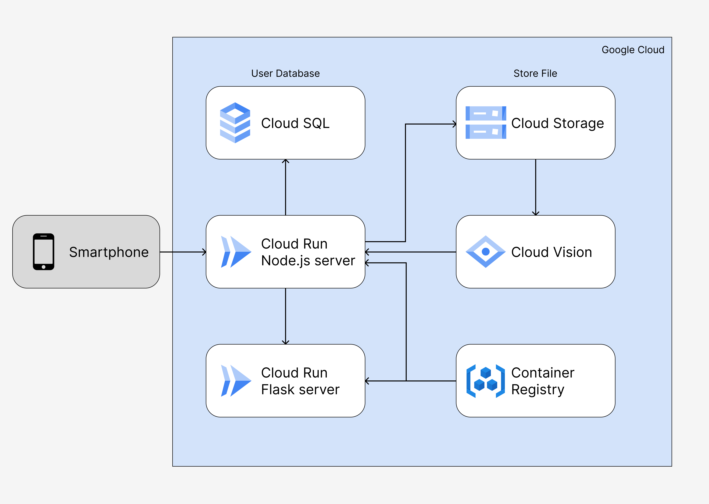

# Deploying to GCP

Here are the steps to manually deploy our back-end to Google Cloud Platform. Every command is run in Cloud Shell unless specified otherwise.

GCP services used:

- Cloud Run
- Cloud SQL
- Container Registry
- Cloud Storage
- Cloud Vision

## GCP architecture



## Set environment variables and enable services

```bash
export PROJECT_ID=$(gcloud config get-value project)

gcloud services enable run.googleapis.com && \
gcloud services enable sqladmin.googleapis.com && \
gcloud services enable containerregistry.googleapis.com && \
gcloud services enable storage-component.googleapis.com && \
gcloud services enable vision.googleapis.com
```

## GCS setup

1. Make bucket.

   ```bash
   gsutil mb -l asia-southeast2 gs://storage-cakrawala
   ```

2. Upload the .sql file for later use.

## Cloud SQL setup

1. Create MySQL instance.

   ```bash
   gcloud sql instances create cakrawala-db \
        --project=$PROJECT_ID \
        --network=projects/$PROJECT_ID/global/networks/default \
        --no-assign-ip \
        --database-version=MYSQL_8_0 \
        --cpu=2 \
        --memory=4GB \
        --region=asia-southeast2 \
        --root-password=123
   ```

2. Create database.

   ```bash
   gcloud sql databases create cakrawala_db --instance=cakrawala-db
   ```

3. Create user.

   ```bash
   gcloud sql users create root \
       --password=123 \
       --instance=cakrawala-db
   ```

4. Import MySQL database.

   1. Click `cakrawala-db` instance.
   2. Click import from the top menu.
   3. Browse and select the .sql file uploaded before.
   4. For destination, choose cakrawala-db.
   5. Click import.

5. Show SQL instance IP, copy and save for later use.

   ```bash
   gcloud sql instances describe cakrawala-db \
       --format=json | jq \
       --raw-output ".ipAddresses[].ipAddress"
   ```

6. Add Cloud SQL Client role to Compute Engine service account.

   ```bash
   gcloud projects add-iam-policy-binding $PROJECT_ID \
       --member="serviceAccount:$PROJECT_NUMBER-compute@developer.gserviceaccount.com" \
       --role="roles/cloudsql.client"
   ```

7. Create Serverless VPC Access connector.

   ```bash
   gcloud compute networks vpc-access connectors create anticede-connector \
       --region=${REGION} \
       --range=10.8.0.0/28 \
       --min-instances=2 \
       --max-instances=3 \
       --machine-type=f1-micro
   ```

## Cloud Run setup

This part is mostly manual because we didn't configure a CI/CD pipeline.

## Flask Server

1. Clone project repo from GitHub.

   ```bash
   mkdir ML
   cd ML
   git clone clone https://github.com/farhaznurjananto/cakrawala
   cd cakrawala
   ```

2. Create file `config.yml`.

   ```bash
   sandbox_server_key: #Sanbox key server midtrans
   production_server_key: #Prodcution key server midtrans
   sandbox_url: #Sandbox url midtrans
   production_url: #Production url midtrans
   is_production: False
   ```

3. Deploy to Cloud Run.

   ```bash
   export PROJECT_ID=#your GCP project ID

   docker build -t cakrawala-model-v1:test .

   docker tag cakrawala-model-v1:test gcr.io/$PROJECT_ID/cakrawala-model-v1:test
   docker push gcr.io/$PROJECT_ID/cakrawala-model-v1:test

   gcloud run deploy --source .
   ```

## Node.js web server

1. Clone project repo from GitHub.

   ```bash
   mkdir CC
   cd CC
   git clone https://github.com/farhaznurjananto/cakrawala-api
   cd cakrawala-api
   ```

2. Create `.env` file.
   For use with dotenv library. `.env` file should contain these following environment variables:

   ```bash
   DB_HOST=#SQL instance IP address, check above.
   DB_USER="root"
   DB_PASSWORD="123"
   DB_DATABASE="cakrawala_db"
   DB_PORT=3306
   SECRET_STRING="secretUserString"
   SECRET_STRING_ADMIN="secretAdminString"
   GOOGLE_APPLICATION_CREDENTIALS=#Credential .json gogle application.
   BUCKET_NAME="storage-cakrawala"
   URL_MODEL=#Cakrawala model cloud run service url, check above.
   SERVER_KEY_MIDTRANS=#Midtrans key server.
   ```

3. Edit `.gitignore` file. Edit `.gitignore` file to:

   ```bash
   node_modules
   ```

4. Create Folder `key`. Upload file Google Application Credential before.

5. Deploy to Cloud Run

   ```bash
   export PROJECT_ID=#your GCP project ID

   docker build -t cakrawala-api-v1:test .

   docker tag cakrawala-api-v1:test gcr.io/$PROJECT_ID/cakrawala-api-v1:test
   docker push gcr.io/$PROJECT_ID/cakrawala-api-v1:test

   gcloud run deploy --source .
   ```
